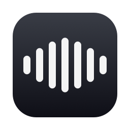

<p align="center">
  
</p>

<h1 align="center">Murmur</h1>

<p align="center">
  <b>Hold right ⌘ · speak · release — your words appear wherever you're typing.</b><br>
  A tiny, open-source, superwhisper-style dictation app for macOS.
</p>

<p align="center">
  
  
  
  
</p>

---

Murmur lives in your menu bar. Hold the right **⌘** key anywhere — in Mail, Slack,
your editor, a browser — and talk. Release the key and the transcribed text is
pasted right where your cursor is. That's the whole app.

- 🪶 **Minimal** — a menu bar icon and a small floating waveform HUD. No windows, no accounts, no telemetry.
- 🔒 **Local by default** — transcribes on-device with NVIDIA **Parakeet TDT 0.6B**
  via Core ML ([FluidAudio](https://github.com/FluidInference/FluidAudio)).
  Your audio never leaves your Mac. ~0.5 s warm-start on Apple Silicon.
- ☁️ **Bring your own cloud (optional)** — switch the engine to **ElevenLabs Scribe**
  and paste in your API key if you already pay for ElevenLabs.
- ⌨️ **True push-to-talk** — hold right ⌘ (or right ⌥ / right ⌃). **Esc** cancels.
  Regular ⌘-shortcuts keep working, even ones that use the right ⌘ key.
- 📋 **Polite pasting** — inserts via ⌘V and restores whatever was on your clipboard afterwards.
- 🌍 **25 languages** locally (Parakeet v3), or English-optimized (v2), or 90+ via ElevenLabs.

## Install

Requires macOS 14+ (Apple Silicon recommended) and the Xcode command line tools
(`xcode-select --install`).

```bash
git clone https://github.com/daviddao/murmur.git
cd murmur
make install        # builds Murmur.app and copies it to /Applications
open /Applications/Murmur.app
```

Prefer to try it first? `make run` launches it from the local `build/` folder.

## First run

1. **Microphone** — click *Allow* on the prompt.
2. **Accessibility** — needed to detect the right ⌘ key globally and to paste.
   System Settings → Privacy & Security → Accessibility → enable **Murmur**.
3. The first launch downloads the Parakeet model (~470 MB) from Hugging Face
   and caches it. The menu bar shows `Parakeet: ready` when done.
4. Put your cursor in any text field, **hold right ⌘**, talk, release. ✨

## Settings

Menu bar icon → **Settings…**

| Setting | Options |
|---|---|
| Hold to dictate | Right ⌘ (default) · right ⌥ · right ⌃ |
| Engine | Parakeet (local, default) · ElevenLabs (cloud) |
| Parakeet model | v3 multilingual (25 languages) · v2 English-only |
| ElevenLabs | API key · Scribe v2/v1 · optional language hint |
| Extras | Sounds on/off · launch at login |

## How it works

```
right ⌘ down                      release
     │                               │
CGEventTap ──▶ AVAudioEngine ──▶ 16 kHz mono Float32 ──▶ Parakeet (Core ML)
(flagsChanged)  (mic capture)                        └─▶ ElevenLabs Scribe API
                                                              │
                    your app ◀── synthetic ⌘V (clipboard restored) ◀── text
```

A floating, click-through `NSPanel` shows a live waveform while you speak and
the result when it lands. Everything is plain Swift + SwiftUI — no Electron,
the binary is ~8 MB.

### Debug from the terminal

The app binary doubles as a CLI for testing the local engine:

```bash
.build/release/Murmur transcribe path/to/audio.wav
```

## Troubleshooting

- **Nothing happens when I hold right ⌘** — check Accessibility permission.
  After rebuilding from source, macOS may require you to toggle the grant
  off/on again (the app is ad-hoc signed, so the signature changes per build).
- **`Parakeet: preparing model…` for a long time** — first run downloads
  ~470 MB from `huggingface.co`. Check your connection; it's cached afterwards in
  `~/Library/Application Support/FluidAudio/`.
- **Text appears in the wrong app** — the text is pasted into whatever app has
  keyboard focus when transcription finishes.
- **Esc** cancels a recording you didn't mean to start; taps shorter than
  0.35 s are ignored.

## Privacy

With the default Parakeet engine, audio is recorded to memory, transcribed
on-device, and discarded. Nothing is written to disk, nothing is sent anywhere.
With the ElevenLabs engine, audio is sent to the ElevenLabs API under your key
and their [privacy terms](https://elevenlabs.io/privacy).

## Acknowledgements

- [FluidAudio](https://github.com/FluidInference/FluidAudio) — Parakeet TDT on Core ML, doing the heavy lifting
- NVIDIA [Parakeet TDT 0.6B](https://huggingface.co/FluidInference/parakeet-tdt-0.6b-v3-coreml) — a remarkable little ASR model
- [superwhisper](https://superwhisper.com) — the UX inspiration; if you want a polished, full-featured product, buy it!

## License

[MIT](LICENSE)
